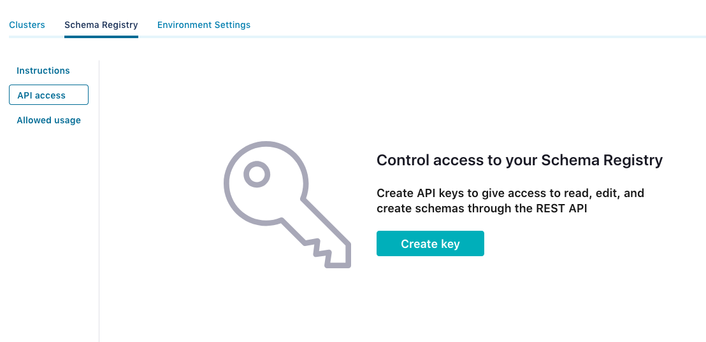
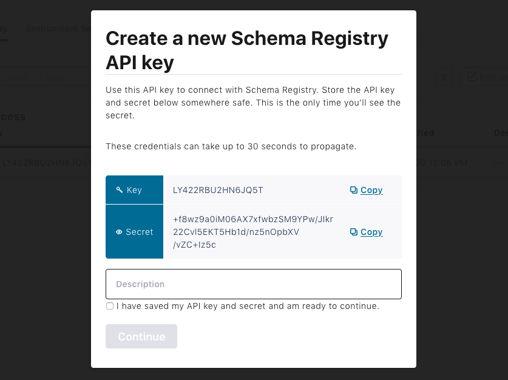

# Avro Schema Parser

An AsyncAPI schema parser for Avro 1.x schemas.

## Installation

```
npm install @asyncapi/avro-schema-parser
```

## Usage

```js
const parser = require('@asyncapi/parser')
const avroSchemaParser = require('@asyncapi/avro-schema-parser')

parser.registerSchemaParser(avroSchemaParser);

const asyncapiWithAvro = `
asyncapi: 2.0.0
info:
  title: Example with Avro
  version: 0.1.0
channels:
  example:
    publish:
      message:
        schemaFormat: 'application/vnd.apache.avro;version=1.9.0'
        payload: # The following is an Avro schema in YAML format (JSON format is also supported)
          type: record
          name: User
          namespace: com.company
          doc: User information
          fields:
            - name: displayName
              type: string
            - name: email
              type: string
            - name: age
              type: int
`

await parser.parse(asyncapiWithAvro)
```

### Usage with remote references

```js
const parser = require('@asyncapi/parser')
const avroSchemaParser = require('@asyncapi/avro-schema-parser')

parser.registerSchemaParser(avroSchemaParser)

const asyncapiWithAvro = `
asyncapi: 2.0.0
info:
  title: Example with Avro
  version: 0.1.0
channels:
  example:
    publish:
      message:
        schemaFormat: 'application/vnd.apache.avro;version=1.9.0'
        payload:
          $ref: 'https://schemas.example.com/user'
`

await parser.parse(asyncapiWithAvro)
```

### Usage with local references

```js
const parser = require('@asyncapi/parser')
const avroSchemaParser = require('@asyncapi/avro-schema-parser')

parser.registerSchemaParser(avroSchemaParser)

const asyncapiWithAvro = `
asyncapi: 2.0.0
info:
  title: Example with Avro
  version: 0.1.0
channels:
  example:
    publish:
      message:
        schemaFormat: 'application/vnd.apache.avro;version=1.9.0'
        payload:
          $ref: 'local/path/to/file/user'
`

await parser.parse(asyncapiWithAvro)
```

### Usage with Confluent Schema Registry

#### Create an API key



#### Copy the key and the secret



#### Use them on your AsyncAPI document

```js
const parser = require('@asyncapi/parser')
const avroSchemaParser = require('@asyncapi/avro-schema-parser')

parser.registerSchemaParser(avroSchemaParser)

const asyncapiWithAvro = `
asyncapi: 2.0.0
info:
  title: Example with Avro
  version: 0.1.0
channels:
  example:
    publish:
      message:
        schemaFormat: 'application/vnd.apache.avro;version=1.9.0'
        payload:
          $ref: 'https://LY422RBU2HN6JQ5T:+f8wz9a0iM06AX7xfwbzSM9YPw/JIkr22Cvl5EKT5Hb1d/nz5nOpbXV/vZC+Iz5c@example.europe-west3.gcp.confluent.cloud/subjects/test/versions/1/schema'
`

await parser.parse(asyncapiWithAvro)
```

## Features

### Support for extra attributes on top of Avro specification

Additional attributes not defined in the [Avro Specification](https://avro.apache.org/docs/current/spec.html) are permitted and are treated as a metadata by the specification. To improve human readability of generated AsyncAPI documentation and to leverage more features from the JSON schema we included support for the extra attributes that can be added into Avro document.

#### List of all supported extra attributes

- `example` - Can be used to define the example value from the business domain of given field. Value will be propagated into [examples attribute](https://json-schema.org/draft/2020-12/json-schema-validation.html#rfc.section.9.5) of JSON schema and therefore will be picked for the generated "Example of payload" when using some AsyncAPI documentation generator.

### Support for names and namespaces

If, at the top level of the Avro schema, the 'name' attribute is defined, it will be copied to the corresponding JSON schema's 'x-parser-schema-id' attribute. If the Avro schema also has the 'namespace' attribute defined, then that schema's fully qualified name will be put into that attribute. The fully qualified name is defined by the namespace, followed by a dot, followed by the name.

If there are two schemas that resolve to the same fully qualified name, only the last one will be returned by the parser. Make sure names of your schemas are unique.

If no name attribute is present, the 'x-parser-schema-id' will have a generated unique id with a name like 'anonymous-schema-1' generated by the main parser. 'x-parser-schema-id' is one of the [custom extensions](https://github.com/asyncapi/parser-js/#custom-extensions) supported by the parser.

## Limitations

### Float and double-precision numbers

JSON numbers ([RFC 4627, section 2.4](http://tools.ietf.org/html/rfc4627)) don't define any limit to the scale and/or precision of numbers. That said, we can enforce limits on `int` and `long` but we can't enforce them on `float` and `double` because they can't accurately be represented on JSON Schema.

### Hardcoded key and secret

This is not a limitation of this package per se but of the [JSON Reference RFC](https://tools.ietf.org/html/draft-pbryan-zyp-json-ref-03). So far, you can only hardcode the values for `key` and `secret` on the `$ref` URL.
